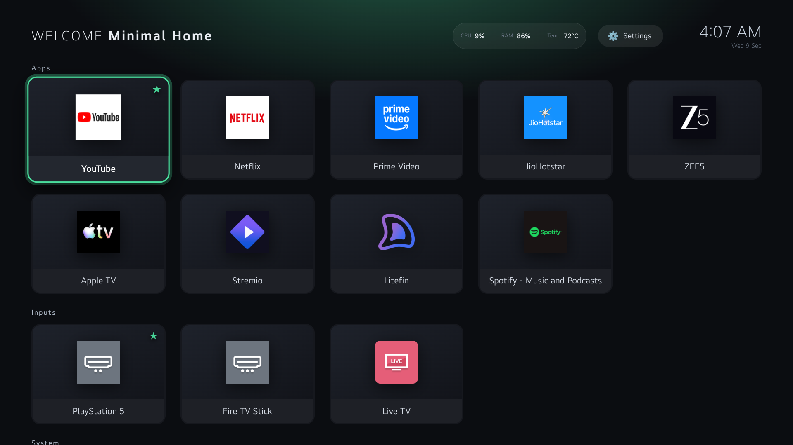
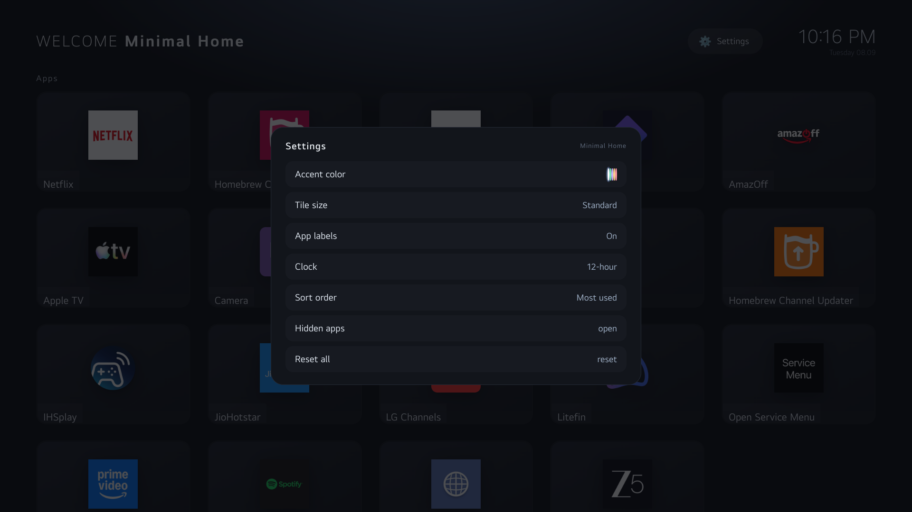
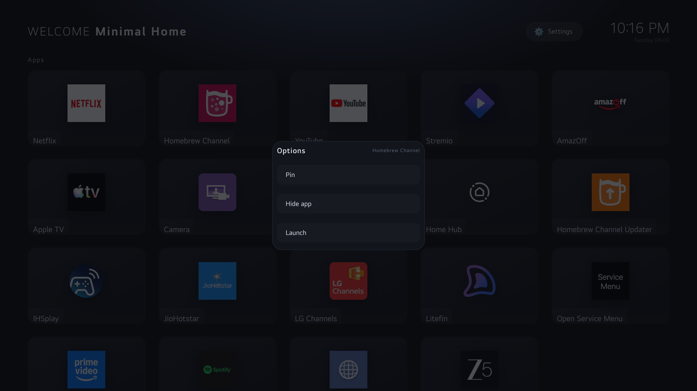
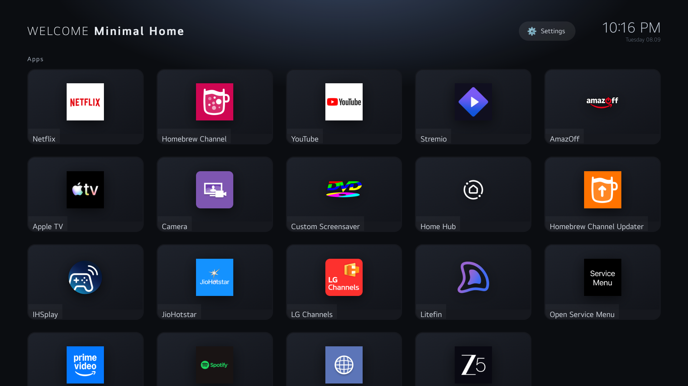
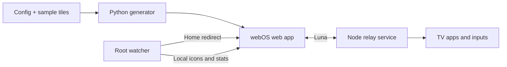

# Minimal Home for LG webOS

A minimal, ad-free home screen for **rooted LG webOS TVs**. Your apps, connected
inputs, and a clock on a dark background, with navigation designed for a TV remote.

[](https://github.com/Pragalbha-Patil/webos-minimal-home/actions/workflows/ci.yml)
[Contributing](CONTRIBUTING.md) · [Installation](docs/INSTALL.md) ·
[Configuration](docs/CONFIGURATION.md) · [MIT license](LICENSE)



## Features

- Live app and input discovery when the launcher regains focus.
- Recent-app ordering, a configurable priority list, and alphabetical sorting.
- Pinning, hiding, search, and a settings panel for appearance and clock options.
- D-pad navigation, per-tile menus with Menu/Info or a long press of OK, and Back handling.
- Foreground-event redirects from LG Home, with a ten-minute bypass via the LG Home tile.
- Optional CPU, memory, and temperature readings, where the TV exposes them.
- A loading indicator while the TV discovers apps, inputs, and system tiles.

## Get started

**On your computer:** Python 3.10+ and Git. Contributors also need Node.js
22.22.2+ (22.x) or 24.15+ (24.x), and the host-only npm development tools.
No Python packages or npm runtime dependencies are deployed to the TV.

**On the TV:** root access, SSH, Node.js, the platform-provided `webos-service`
module, and the required Luna service registration and permissions. This project
does not root your TV. Device notes cover webOS 10.3.1; there is no verified
compatibility matrix across TV models or firmware.

```sh
git clone https://github.com/Pragalbha-Patil/webos-minimal-home.git
cd webos-minimal-home
npm ci --ignore-scripts
python build_launcher.py
python tools/check.py
```

For a desktop preview, first run `python build_launcher.py --preview`, then
`python -m http.server 8000 --bind 127.0.0.1` and open
`http://127.0.0.1:8000/launcher-app/`. The grid and navigation work with the
sample tiles; app launches and TV settings require Luna on a TV. Some icons
will be missing until the on-device watcher provisions them. Restore the normal
build with `python build_launcher.py` before committing or packaging.

For an already registered installation, use a POSIX shell (Git Bash or WSL on Windows):

```sh
TV_HOST=mytv sh tools/install.sh --check
TV_HOST=mytv sh tools/install.sh
```

The installer uploads app/service files and requests launch. **It does not
register Luna permissions or install a boot hook.** Read the
[installation and recovery guide](docs/INSTALL.md) before first use. Downloaded
release archives include their own installation guide and checksum.

## Controls and settings

| Action | Control |
| --- | --- |
| Move between tiles | D-pad |
| Launch a tile | OK |
| Open a tile's pin/hide menu | Menu/Info or hold OK |
| Search apps | Type a letter on a connected keyboard |
| Close an overlay | Back |
| Open launcher preferences | Settings tile or header gear |
| Temporarily return to stock Home | LG Home tile |

The [configuration guide](docs/CONFIGURATION.md) covers greetings, app priorities,
system tiles, persistent preferences, and personal preview builds.

## Change configuration on the TV

After installing this version, edit the **service-local** file on the TV:
`/media/developer/apps/usr/palm/services/org.minimal.home.service/config.json`.
Changes to `header.text`, `header.brand`, `ui.system`, and `ui.appsPriority`
apply on the next launcher startup or TV boot, without rebuilding the app.

To apply changes while the TV is running, connect over SSH and edit a temporary
copy so the launcher cannot read a partly written file:

```sh
cd /media/developer/apps/usr/palm/services/org.minimal.home.service
cp config.json config.json.bak
cp config.json config.json.new
vi config.json.new
node -e 'JSON.parse(require("fs").readFileSync("config.json.new", "utf8"))' && mv config.json.new config.json
luna-send -n 1 luna://com.webos.applicationManager/launch '{"id":"org.minimal.home"}'
```

Keep the existing JSON structure and field types; the command checks JSON syntax.
Relaunching requests a live refresh. You can also open another app and return to
Minimal Home. No service restart or reboot is needed for config edits; the
foreground screen does not continuously poll the file. See the
[configuration guide](docs/CONFIGURATION.md#on-tv-configuration) for field behavior
and automatic update preservation.

## Screenshots

| Settings | Per-app options | Search |
| --- | --- | --- |
|  |  |  |

## How it works



| Location | Purpose |
| --- | --- |
| `launcher-app/src/` | Frontend HTML template, CSS, and JavaScript sources |
| `build_launcher.py` | Assembles sources into a page that loads live TV tiles |
| `launcher-app/config.json` | Source configuration and version |
| `launcher-app/index.html` | Committed generated page; edit sources and rebuild |
| `launcher-service/` | Luna relay, watcher, shared validation, storage, and stream parser |
| `tests/` | Python, Node VM, and full DOM regression tests |
| `tools/` | Shared checks, release packaging, and installer |
| `docs/` | Configuration, architecture, installation, and coding standards |
| `AGENTS.md`, `CLAUDE.md` | Coding-agent entry points |

See [architecture](docs/ARCHITECTURE.md) for generated-file ownership, runtime
boundaries, and webOS constraints.

## Contribute

Documentation, bug reports, regression tests, accessibility work, and device
compatibility reports are welcome. A TV is not required for most local work.
Start with [CONTRIBUTING.md](CONTRIBUTING.md) and the
[coding standards](docs/CODING_STANDARDS.md). The [testing guide](docs/TESTING.md)
explains the enforced JavaScript coverage gates. Follow the
[Code of Conduct](CODE_OF_CONDUCT.md); report vulnerabilities through
[SECURITY.md](SECURITY.md).

## Limitations

Root and Luna API availability vary by firmware. Desktop tests cannot establish
device compatibility. The watcher must be running for Home redirection, icon
provisioning, and system statistics. Preferences and recent-app ordering require
a writable service directory.

This is an independent community project, not affiliated with LG. Changes to a
rooted TV are your responsibility; keep a working SSH connection and recovery
path. Licensed under the [MIT license](LICENSE).
