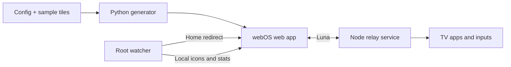

# Minimal Home for LG webOS

A minimal, ad-free home screen for **rooted LG webOS TVs**. Your apps, connected
inputs, and a clock on a dark background, with navigation designed for a TV remote.

[](https://github.com/Pragalbha-Patil/webos-minimal-home/actions/workflows/ci.yml)
[Contributing](CONTRIBUTING.md) · [Installation](docs/INSTALL.md) ·
[Configuration](docs/CONFIGURATION.md) · [MIT license](LICENSE)


## Features

- Live app and input discovery when the launcher regains focus.
- Recent-app ordering, a configurable priority list, and alphabetical sorting.
- Pinning, hiding, search, and a settings panel for appearance and clock options.
- D-pad navigation, per-tile menus with Menu/Info or a long press of OK, and Back handling.
- Foreground-event redirects from LG Home, with a ten-minute bypass via the LG Home tile.
- Optional CPU, memory, and temperature readings, where the TV exposes them.
- A loading indicator while the TV discovers apps, inputs, and system tiles.
- A remote-friendly first-run prompt for naming the launcher header.

## Get started

You need a **rooted LG webOS TV** with SSH and the Homebrew Channel, plus
Python 3.10+, Git, and SSH on your computer. This project does not root your
TV. Device notes cover webOS 10.3.1; there is no verified compatibility matrix
across TV models or firmware.

### Install on your TV (one command)

```sh
git clone https://github.com/Pragalbha-Patil/webos-minimal-home.git
cd webos-minimal-home
sh tools/install.sh mytv
```

Replace `mytv` with your TV's SSH alias, hostname, or IPv4 address
(`TV_HOST=mytv` works too). On Windows Command Prompt, run
`tools\install.cmd mytv` from the repository root instead.

That one command checks prerequisites, builds the package, installs the app,
relay service, and root watcher (Home-button redirection, icons, system
stats), preserves your settings and icons across updates, and launches
Minimal Home. Details, IPK-only installs, and troubleshooting live in the
[installation and recovery guide](docs/INSTALL.md).

### Preview and contribute

For a desktop preview, run `python build_launcher.py --preview`, then
`python -m http.server 8000 --bind 127.0.0.1` and open
`http://127.0.0.1:8000/launcher-app/`. Restore the normal build with
`python build_launcher.py` before committing or packaging.

To contribute, install Node.js 22.22.2+ (22.x) or 24.15+ (24.x), run
`npm ci --ignore-scripts`, and see [CONTRIBUTING.md](CONTRIBUTING.md).
Checks: `python tools/check.py --require-shell`.

## Controls and settings

| Action | Control |
| --- | --- |
| Move between tiles | D-pad |
| Launch a tile | OK |
| Open a tile's pin/hide menu | Menu/Info or hold OK |
| Reorder pinned apps | Tile menu → Move, then ← → · OK saves · Back cancels |
| Search apps | Header Search button, or type a letter on a connected keyboard |
| Close an overlay | Back |
| Open launcher preferences | Settings tile or header gear |
| Temporarily return to stock Home | LG Home tile |

The [configuration guide](docs/CONFIGURATION.md) covers greetings, app priorities,
system tiles, persistent preferences, and personal preview builds.

## Change configuration on the TV

Edit the **service-local** file
`/media/developer/apps/usr/palm/services/org.minimal.home.service/config.json`
directly on the TV; changes apply on the next launcher startup without
rebuilding. See the
[configuration guide](docs/CONFIGURATION.md#on-tv-configuration) for the
safe-edit recipe and field behavior.

## Screenshots

| Settings | Per-app options | Search |
| --- | --- | --- |
|  |  |  |

## How it works



| Location | Purpose |
| --- | --- |
| `launcher-app/src/` | Frontend HTML template, CSS, and JavaScript sources |
| `build_launcher.py` | Assembles sources into a page that loads live TV tiles |
| `launcher-app/config.json` | Source configuration and version |
| `launcher-app/index.html` | Committed generated page; edit sources and rebuild |
| `launcher-service/` | Luna relay, watcher, shared validation, storage, and stream parser |
| `tests/` | Python, Node VM, and full DOM regression tests |
| `tools/` | Shared checks, release packaging, and installer |
| `docs/` | Configuration, architecture, installation, and coding standards |
| `AGENTS.md`, `CLAUDE.md` | Coding-agent entry points |

See [architecture](docs/ARCHITECTURE.md) for generated-file ownership, runtime
boundaries, and webOS constraints.

## Contribute

Documentation, bug reports, regression tests, accessibility work, and device
compatibility reports are welcome. A TV is not required for most local work.
Start with [CONTRIBUTING.md](CONTRIBUTING.md) and the
[coding standards](docs/CODING_STANDARDS.md). The [testing guide](docs/TESTING.md)
explains the enforced JavaScript coverage gates. Follow the
[Code of Conduct](CODE_OF_CONDUCT.md); report vulnerabilities through
[SECURITY.md](SECURITY.md).

## Limitations

Root and Luna API availability vary by firmware. Desktop tests cannot establish
device compatibility. The watcher must be running for Home redirection, icon
provisioning, and system statistics. Preferences and recent-app ordering require
a writable service directory.

This is an independent community project, not affiliated with LG. Changes to a
rooted TV are your responsibility; keep a working SSH connection and recovery
path. Licensed under the [MIT license](LICENSE).
