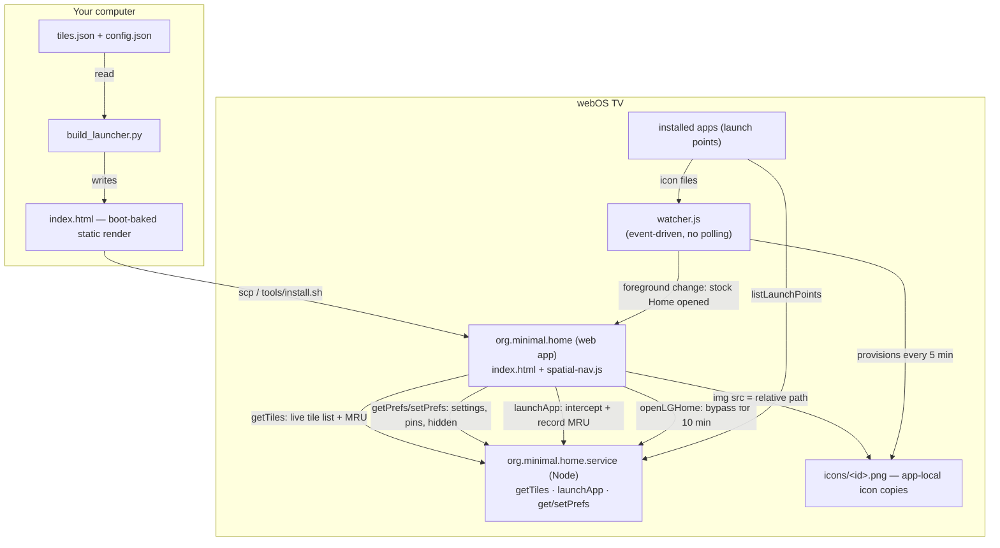

# Minimal Home — LG webOS Launcher

A minimalist, ad-free home screen replacement for **rooted LG webOS TVs** (developed on webOS 23).

No recommendations rows. No promotional tiles. No carousel of content you will never watch. Just
**your apps**, **your inputs**, and a clock — on a near-black, OLED-friendly background.


## Features

- **Ad-free & distraction-free** — only what you actually use, sorted three ways:
  - **Most recently used** apps first (persisted to disk on the TV, capped at 60 entries)
  - Then a curated priority list, then the rest alphabetically
- **Live tile refresh** — app list re-fetches from the TV when the launcher regains focus, so
  newly installed apps appear without a rebuild
- **Remote-friendly** — full D-pad spatial navigation, auto-focus on boot, arrow-repeat and
  row-wrapping, plus a letters-search overlay (press any letter, keep typing to filter)
- **Per-app options** — press **Menu/Info** (or hold **OK**) on a tile to **pin/unpin**, **hide**,
  or launch it; hidden apps are restored from the Settings panel
- **No polling watcher** — an event-driven service reacts instantly to foreground changes and
  redirects stock LG Home to Minimal Home
- **Built-in bypass** — an "LG Home" tile lets you temporarily reach the stock launcher
  (10-minute hold-off, so it doesn't immediately bounce you back)
- **Static-configured, dynamic-runtime** — the UI works even before the relay service answers,
  then upgrades in place to the live tile set
- **Configurable greeting** — tweak the header text without touching code (`launcher-app/config.json`)

## Contents

- [Requirements](#requirements)
- [Build](#build)
- [Install on the TV](#install-on-the-tv)
- [Configuration](#configuration)
- [Screenshots](#screenshots)
- [How it works](#how-it-works)
- [Repository layout](#repository-layout)
- [Development](#development)
- [Known limitations](#known-limitations)
- [Contributing](#contributing)
- [Disclaimer](#disclaimer)

## Requirements

- A **rooted** LG webOS TV with SSH access (see the
  [webOS Homebrew project](https://www.webosbrew.org) — Homebrew Channel, root tooling).
  Developed and tested on **webOS 23**.
- Python 3.7+ to build the launcher page.
- Everything else runs **on the TV**: the app is a plain webOS web app, the relay service and
  watcher are Node.js (webOS ships Node).

## Build

```sh
git clone https://github.com/Pragalbha-Patil/webos-minimal-home.git
cd webos-minimal-home
python build_launcher.py
```

This reads `launcher-app/tiles.json` (a sample launch-point snapshot) and `launcher-app/config.json`
and generates `launcher-app/index.html`. The generated page is the app's entry point
(`main` in `appinfo.json`), so the whole `launcher-app/` folder is what runs on the TV.

> **Note:** the launcher re-fetches the real, live tile list over Luna from the relay service when
> it starts. `tiles.json` is only the static fallback that renders instantly on boot — it does not
> need to match your TV exactly. To snapshot your own TV's launch points, grab the output of:

```sh
luna-send -n 1 luna://com.webos.applicationManager/listLaunchPoints '{}'
```

### On-launcher settings panel

Press the **⚙ Settings** tile (or the gear in the header) to open the in-launcher settings panel.
Preference changes persist to disk on the TV and survive relaunches:

| Row | What it does |
| --- | --- |
| **TV settings** | Opens the TV's actual system-settings layout (exits the launcher panel) |
| **Accent color** | Cycles the highlight color (steel / emerald / violet / amber / crimson) with Left/Right |
| **Tile size** | Compact / standard / large grid density |
| **App labels** | Shows or hides the text under each icon |
| **Clock** | 12-hour or 24-hour time display |
| **Sort order** | Most used / alphabetical / pinned-first ordering of the tile grid |
| **Hidden apps** | Lists hidden apps; select one to restore it to the grid |
| **Reset all** | Restores every preference to its default |
| **Close panel** | Closes the settings panel (also closes the per-tile menu) |

Use **Left/Right** on a row to cycle its value and **OK** to toggle; **Back** returns to the grid.
The launcher never shows an exit prompt: `appinfo.json` sets `disableBackHistoryAPI`, so the webview
owns the Back key (it collapses the open panel first, then does nothing on the grid) instead of the
TV's history-based exit dialog.

### Pinning, hiding and search

- **Pin / Unpin** and **Hide app** live in a per-tile menu — press **Menu** or **Info** (key 412/457),
  or hold **OK** for a moment on the tile you want. Pinned apps jump to the front of their row with
  a ★ badge; hidden apps are removed from the grid (restore them under Settings → Hidden apps).
- **Search** — start typing any letter to open the search overlay and filter the grid live;
  press **Backspace** to edit the query and **OK** to launch the top match.

## Install on the TV

No credentials are bundled in this repository (your TV's address, SSH credentials and
personal tooling stay out of the public tree). Deploy via `ssh`/`scp` as `root` on your rooted TV.
Two ways:

**Option A - installer script** (recommended). Credential-free: supply only the TV address.
Point it at your TV via an `~/.ssh/config` host alias or `TV_HOST`:

```sh
TV_HOST=mytv ./tools/install.sh          # build + deploy + relaunch
TV_HOST=mytv ./tools/install.sh --check  # verify target paths, change nothing
```

The installer reads `TV_USER` (default `root`), `APP_ID` and `SVC_ID` from the environment,
never hardcodes a password, and can be run non-interactively alongside a boot hook.

**Option B - manual `scp`.** Use the trailing `/./` to flatten a directory into its target:

```sh
# 1. Build the app locally
python build_launcher.py

# 2. Upload the app
ssh root@<TV-IP> "mkdir -p /media/developer/apps/usr/palm/applications/org.minimal.home"
scp -r launcher-app/. root@<TV-IP>:/media/developer/apps/usr/palm/applications/org.minimal.home/

# 3. Upload the relay service
ssh root@<TV-IP> "mkdir -p /media/developer/apps/usr/palm/services/org.minimal.home.service"
scp -r launcher-service/. root@<TV-IP>:/media/developer/apps/usr/palm/services/org.minimal.home.service/

# 4. Launch it
ssh root@<TV-IP> "luna-send -n 1 luna://com.webos.applicationManager/launch '{\"id\":\"org.minimal.home\"}'"
```

To make Minimal Home the launcher that opens instead of stock LG Home, start the redirect
watcher once and have it autostart at boot (e.g. from your root boot-hook script — webOS Homebrew
users typically have one already):

```sh
# on the TV, after a boot hook is in place:
setsid node /media/developer/apps/usr/palm/services/org.minimal.home.service/watcher.js \
  </dev/null >/dev/null 2>&1 &
```

## Configuration

### Header greeting — `launcher-app/config.json`

```json
{
    "header": {
        "text": "Welcome",
        "brand": "Minimal Home"
    }
}
```

`text` is rendered small-and-regular, `brand` is rendered bold. The greeting is **per-Tv** config:
the built-in `index.html` ships a generic "Welcome Minimal Home" banner, and `getTiles` serves your
`config.json` header at runtime so each TV reads its own name. Change `text`/`brand` in this file and
redeploy `launcher-app/` + `launcher-service/` (no rebuild needed).

### System app allowlist — `launcher-app/config.json`

Inputs are **not configured here**: the TV publishes a launch point for every connected input
(HDMI/AV/DP ports show up automatically, disappear when unplugged, and reappear if you plug a
device back in), and the service classifies those launch points as the **Inputs** row. Only the
non-third-party system apps you want exposed as tiles — and the Settings tile — are listed here.
`launcher-service/service.js` loads this from the **same** `config.json` the build uses, so the
live tile list and the baked page can't drift:

```json
"ui": {
  "system": ["com.webos.app.discovery", "com.webos.app.mediadiscovery", "com.palm.app.settings"]
}
```

Add a `com.webos.app.*` id to `system` if you want a particular system app to appear as a tile;
that list also lets the Settings tile be optional.

### Icons

The app runs from `file://` and its webview refuses absolute filesystem paths in ``
(outside the app's own directory), so icon file paths from launch points can't be referenced
directly. Instead the **watcher** — which runs unconfined — copies every launch point's icon into
`org.minimal.home/icons/<id>.png`, and `getTiles` returns those app-relative paths. The watcher
re-provisions icons every 5 minutes, so newly installed apps get icons automatically.

### Most-recently-used ordering

`launcher-service/service.js` records every successful app launch to `usage.json` next to the
service (capped to 60 entries). `getTiles` sorts by that stamp, newest first, then by the
priority list in `launcher-app/config.json` (`ui.appsPriority`), then alphabetically. When you
rebuild locally, `build_launcher.py` bakes that same MRU order from `launcher-service/usage.json`
so the static page matches the live list.

## Screenshots

|          Minimal Home          |           Settings            |
| :---------------------------: | :---------------------------: |
|  |  |

|          Per-app options       |           Search              |
| :---------------------------: | :---------------------------: |
|  |  |

Re-capture with the CDP helper (TV DevTools Server must be running on port
9998 — same one `webOS Dev Manager` exposes in developer mode):

```bash
python private/devtools/shot.py docs/screenshots/home.png
```

Captures the webview's live render at full TV resolution (1920×1080). Because
the webview reports itself unfocused while under the DevTools connection, the
D-pad focus ring does not appear in these captures — drive navigation from the
remote for shots that need the focus highlight.

## How it works

Two components run on the TV plus one build-time generator on your computer:



1. **Build time** — `build_launcher.py` bakes a clean, static launcher from a launch-point
   snapshot so the screen renders instantly, before any service is reachable.
2. **Runtime app** — `index.html` calls `luna://org.minimal.home.service/getTiles`, rebuilds the
   grid from the live tile list, and re-sorts on every return to foreground.
3. **Relay service** — the app is a plain webOS *web* app, which cannot launch arbitrary apps
   directly; the service does the privileged `launch` calls for it and persists MRU data.
4. **Redirect watcher** — subscribes to `getForegroundAppInfo`. When stock `com.webos.app.home`
   comes to the foreground, it launches Minimal Home instead — unless the user just opened it via
   the "LG Home" tile, in which case the bypass file (`~/.noredirect`) is honored for 10 minutes.

## Repository layout

```
webos-minimal-home/
├── build_launcher.py        # build-time generator for the launcher page
├── launcher-app/            # the webOS web app (what runs on screen)
│   ├── appinfo.json         # webOS app manifest
│   ├── config.json          # header greeting + UI config
│   ├── tiles.json           # sample launch-point snapshot for local builds
│   ├── spatial-nav.js       # (deprecated) replaced by the baked-in launcher logic
│   └── index.html           # GENERATED by build_launcher.py (app entry point)
├── launcher-service/        # the Node relay service + redirect watcher
│   ├── service.js           # getTiles / launchApp / openLGHome + MRU persistence
│   ├── watcher.js           # event-driven LG Home → Minimal Home redirect
│   ├── services.json        # Luna service registration
│   └── package.json
└── private/                 # (git-ignored) personal dev tooling, backups, scripts
```

## Development

- **Build & iterate** — `python build_launcher.py` regenerates `index.html`.
  To preview in a desktop browser, comment out the `PalmServiceBridge`/`navigator.service`
  calls or open it with a small static server; the tile rendering and remote navigation work
  without Luna.
- **On-TV workflow** — the app can be pushed with any SFTP/SCP tool; the service needs
  `services.json` in place and a restart of the Luna service manager (`systemctl restart sam`
  on some firmware) to pick up the new service code.
- **Patches welcome** — see [CONTRIBUTING](CONTRIBUTING.md).

## Known limitations

- Requires a rooted TV — this is not a replacement for stock Home on unrooted firmware, and it
  does **not** bundle any root exploit.
- The MRU ordering persists only while the service dir is writable
  (`/media/developer/apps/usr/palm/services/org.minimal.home.service/`).
- Tested on **webOS 23**; older or newer firmware generations may differ in Luna API availability.
- The redirect watcher leans on `luna-send getForegroundAppInfo` subscribing; behavior may vary
  between firmware versions.

## Contributing

Issues, ideas and pull requests are welcome — from new themes and tile sections to input
management and accessibility. Start with [CONTRIBUTING](CONTRIBUTING.md). Please also review our
[Code of Conduct](CODE_OF_CONDUCT.md).

## Disclaimer

**Use at your own risk.** This project modifies a rooted TV: you assume all responsibility for
your device, firmware, and warranty implications. Sensitive operational details
(credentials, personal snapshots, debug logs) intentionally live in the git-ignored `private/`
directory and are **not** part of the public repository. See [SECURITY](SECURITY.md).
